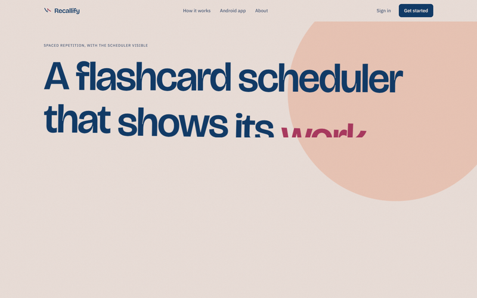
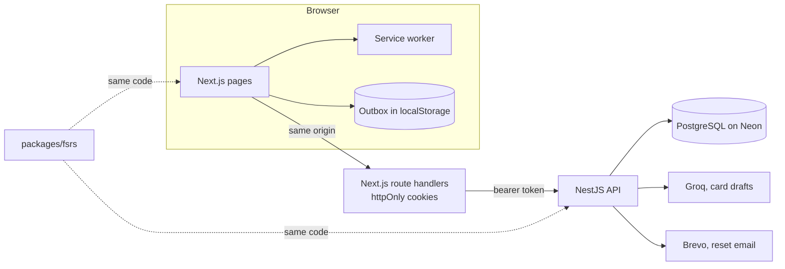
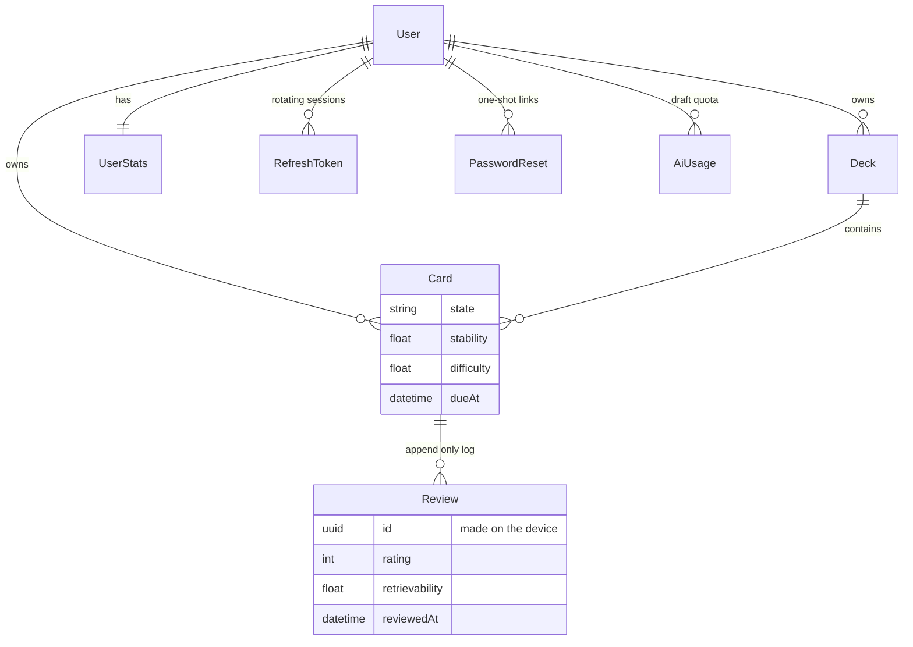

# Recallify

[](https://github.com/yatharthrathii/Recallify/actions/workflows/ci.yml)
[](https://github.com/yatharthrathii/Recallify/actions/workflows/uptime.yml)

A flashcard app built on FSRS that shows its work: the forgetting curve of every
card, why a card is due today, and what your own review history says about the
default parameters.



**Live:** [recallify-five.vercel.app](https://recallify-five.vercel.app)
&nbsp;·&nbsp; **API docs:** [recallify-api.vercel.app/docs](https://recallify-api.vercel.app/docs)

No signup needed to look around: **Try the demo** on the front page opens a
private account with six months of history, deleted after a day.

## What it does

- **Schedules every card with FSRS**, implemented from the published algorithm
  in [`packages/fsrs`](packages/fsrs), with no dependencies and no I/O. The same
  function runs on the server, in the browser for instant ratings, and later on
  the phone.
- **Shows the model.** Each card has its forgetting curve. During review, one key
  shows the stability, the chance of recall right now, and the date it slips
  below your target. The retention slider prices a higher target in daily
  reviews before you save it.
- **Fits the scheduler to you.** After 400 reviews, gradient descent on your own
  log fits new parameters, backtested against the defaults side by side before
  you adopt them.
- **Keeps working offline.** Answers go to an outbox and are sent when the
  connection returns, each with an id made on the device, so a retry is never
  counted twice. A service worker lets the review screen open with no connection,
  once it has been opened online on that device.
- **Drafts cards with AI** from a topic or your notes (Groq), which you approve one
  by one. Rate limited per user, counted in Postgres so serverless instances
  cannot each hand out a fresh allowance.
- **Accounts done properly.** Argon2id passwords, rotating refresh tokens with
  reuse detection, httpOnly cookies behind a same-origin proxy so no token ever
  reaches JavaScript, password reset by one-shot emailed link, and a sign-in
  limit that does not reveal which addresses exist.

### What it does not do

- Import from other apps. Planned, not built.
- Run as a native app. The Android app is in development; the web app is built
  phone first and can be added to the home screen.
- Promise fewer reviews. A model fitted to someone who forgets quickly asks for
  more of them, and the app says so.

## How it is built



A pnpm and Turborepo monorepo. Everything is TypeScript.

```
apps/
  api/          NestJS 11, REST and OpenAPI, Prisma 6, PostgreSQL
  web/          Next.js 16 App Router, React 19, Tailwind 4, motion
  e2e/          Playwright, against the production builds
packages/
  fsrs/         the scheduler: pure, zero dependencies, 100% covered
  optimizer/    fits parameters to a review log, with a backtest
  contracts/    Zod schemas: validation, types and OpenAPI, defined once
  core/         API client, session logic, outbox, formatting, React hooks
  tokens/       design tokens, the only place a colour value may exist
  config/       shared TypeScript and ESLint presets
```

### Data model

The review log is append only. Card state is a cache that can be rebuilt by
replaying it, which is what the optimizer and the backtest both do.



The full schema, with the reasoning behind each table, is in
[`docs/03-DATA-AND-API.md`](docs/03-DATA-AND-API.md).

## What checks it

Every push runs five jobs in [CI](.github/workflows/ci.yml):

| Job | What it proves |
|---|---|
| lint, typecheck, build | Zero lint warnings allowed. Size budgets on the engine and the web bundle |
| unit tests | About 200 tests over the packages. `packages/fsrs` is held at 100% coverage |
| integration tests | About 90 API tests, most against a real Postgres: ownership, idempotency, rate limits, resets |
| end to end | Playwright on the production builds, desktop and phone: sign up to review to stats, demo, offline review |
| lighthouse | Accessibility, best practices and SEO must stay at 95 or above on public pages |

The FSRS implementation is checked against
[`ts-fsrs`](https://github.com/open-spaced-repetition/ts-fsrs), the reference
TypeScript implementation, across 19,000 generated cases. `ts-fsrs` is a test
dependency only and is never shipped. FSRS itself is the work of Jarrett Ye and
the Open Spaced Repetition community; this project implements it, it did not
invent it.

A separate [uptime workflow](.github/workflows/uptime.yml) checks the live API
and web app every 30 minutes.

## Running it

Needs Node 22, pnpm 9, and either Docker or a Postgres connection string.

```bash
pnpm install
cp .env.example .env     # fill in the two JWT secrets
pnpm up                  # local Postgres in Docker
pnpm db:migrate          # apply the schema
pnpm db:seed             # optional: an account with six months of history
pnpm dev                 # API on :3001, web on :3000
```

Generate each JWT secret with `openssl rand -base64 48`. The seeded account is
`dev@recallify.local` with the password `correct-horse-battery`.

| | |
|---|---|
| Web | http://localhost:3000 |
| API | http://localhost:3001 |
| API docs | http://localhost:3001/docs |
| Health | http://localhost:3001/health |

The AI key (`GROQ_API_KEY`) and the email key (`BREVO_API_KEY`) are optional.
Without them, drafting answers 503 and reset links are printed to the API log
instead of sent.

```bash
pnpm lint && pnpm typecheck      # what CI runs first
pnpm test                        # unit and integration tests
pnpm build && pnpm test:e2e      # end to end, on the production builds
pnpm size                        # bundle budgets
pnpm lighthouse                  # accessibility and SEO on public pages
```

## Documentation

| | |
|---|---|
| [`docs/01-PRODUCT.md`](docs/01-PRODUCT.md) | Thesis, competitors, feature tiers |
| [`docs/02-ARCHITECTURE.md`](docs/02-ARCHITECTURE.md) | System shape, stack, request flow |
| [`docs/03-DATA-AND-API.md`](docs/03-DATA-AND-API.md) | Schema, endpoints, auth |
| [`docs/04-DESIGN-SYSTEM.md`](docs/04-DESIGN-SYSTEM.md) | Colour, type, motion |
| [`docs/05-ENGINEERING.md`](docs/05-ENGINEERING.md) | Budgets, sync, testing, security |
| [`docs/06-ROADMAP.md`](docs/06-ROADMAP.md) | Build order, and what is next |

## Why this is version 2

Version 1 was a React and Firebase app whose README claimed spaced repetition
and AI features that the code did not implement, and whose AI key was readable
in the production bundle. Version 2 is a rebuild held to one rule: nothing is
claimed that the code does not do. Version 1 is kept, unedited apart from the
corrections, on the [`v1-legacy`](https://github.com/yatharthrathii/Recallify/tree/v1-legacy)
branch.

## License

[MIT](LICENSE). Made by [Yatharth Rathi](https://github.com/yatharthrathii).
